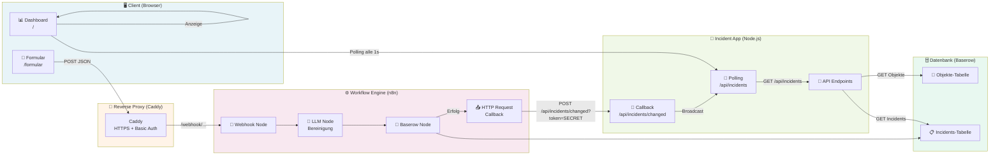
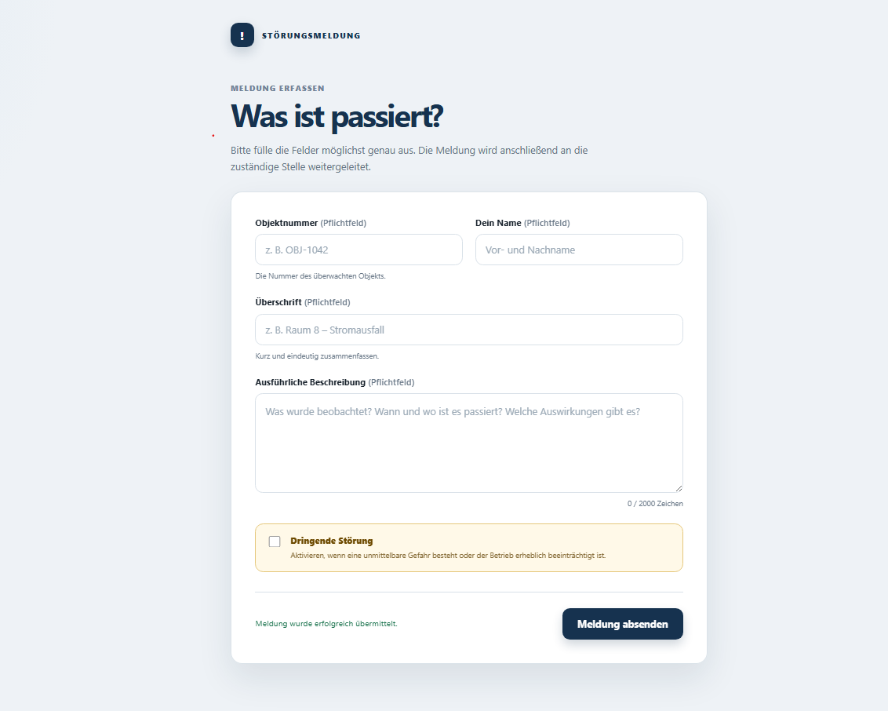
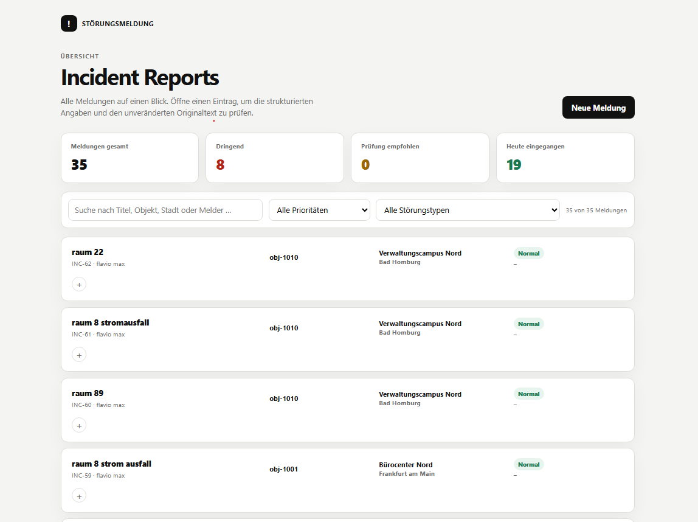
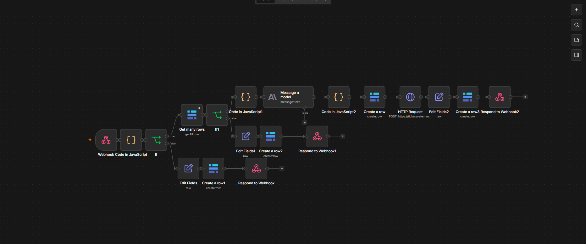

# Incident-System – Automatisierte Stoerungsmeldung

Ein automatisiertes Workflow-System zur digitalen Erfassung von Stoerungsmeldungen aus der Sicherheitsbranche. Das System ersetzt den telefonischen Meldeprozess durch eine Web-basierte Loesung mit automatischer Klassifizierung, Prioritaetsberechnung und Live-Aktualisierung.

**Live-Demo:** [https://ticketsystem.mamonaprojects.de](https://ticketsystem.mamonaprojects.de)

---

## Uebersicht

### Problemstellung

Sicherheitspersonal muss Vorfaelle (Stromausfall, Wasserschaden, Zugangsstoerungen etc.) an eine Zentrale melden. Der bisherige Prozess:

- Telefonische Meldung an die Leitstelle
- Manuelle Erfassung durch Mitarbeiter
- Risiko von Informationsverlusten
- Keine strukturierte Dokumentation
- Hoher manueller Aufwand

### Loesung

- Web-Formular fuer direkte Eingabe vor Ort
- Automatische Bereinigung und Klassifizierung per LLM
- Strukturierte Speicherung in Baserow
- Live-Dashboard mit Filter- und Suchfunktionen
- Duale Prioritaet: manuelle Checkbox + KI-Einschaetzung

---

## Architektur



### Komponenten

| Komponente | Technologie | Aufgabe |
|------------|-------------|---------|
| **Client** | HTML/JS | Formular fuer Eingabe, Dashboard fuer Anzeige |
| **Caddy** | Go | HTTPS, Basic Auth, Reverse Proxy |
| **Incident App** | Node.js/Express | API, Polling-Endpoint, Callback-Handler |
| **n8n** | Node.js | Workflow-Orchestrierung, LLM-Integration |
| **Baserow** | PostgreSQL | Datenbank fuer Objekte und Incidents |

---

## Datenfluss

1. **Formular** (`/formular`)  
   Sicherheitspersonal erfasst Vorfall mit Objektnummer, Beschreibung und optionaler Dringlichkeits-Checkbox.

2. **n8n Webhook**  
   POST-Request mit JSON-Payload an Production-Webhook-URL.

3. **LLM-Bereinigung**  
   Anthropic Claude extrahiert: `incidentType`, `incidentDate`, `incidentTime`, `aiUrgency`.  
   Originaltext bleibt unveraendert erhalten (wichtig bei Deutsch als Zweitsprache).

4. **Baserow-Speicherung**  
   Strukturierter Datensatz wird in der Incidents-Tabelle erstellt.

5. **Callback an Dashboard**  
   n8n sendet POST an `/api/incidents/changed?token=SECRET`.

6. **Live-Update**  
   Dashboard polled alle 1 Sekunde `/api/incidents` und zeigt neue Eintraege automatisch an.

---

## Features

### Kernfunktionen

- ✅ Web-Formular mit Validierung und Duplikatsschutz
- ✅ LLM-gestuetzte Klassifizierung (Stoerungstyp, Datum, Uhrzeit)
- ✅ Duale Prioritaet: manuelle Checkbox + KI-Einschaetzung
- ✅ Live-Aktualisierung des Dashboards (Polling)
- ✅ Filter nach Prioritaet, Stoerungstyp, Suchbegriff
- ✅ Originaltext + bereinigte Beschreibung parallel anzeigen

### Sicherheit

- 🔒 Basic Auth fuer Dashboard (Caddy `.htpasswd`)
- 🔒 Webhook Secret fuer Callback (`INCIDENTS_WEBHOOK_SECRET`)
- 🔒 Baserow Token fuer Datenbankzugriff
- 🔒 HTTPS fuer alle externen Requests (Let's Encrypt via Caddy)

---

## Installation

### Voraussetzungen

- Docker & Docker Compose
- Baserow-Instanz (selbst gehostet oder Cloud)
- n8n-Instanz (selbst gehostet oder Cloud)
- Domain mit DNS-Eintraegen fuer Caddy

### Setup

```bash
# Repository klonen
cd /opt/incident-system

# Umgebungsvariablen setzen
cp .env.example .env
# .env bearbeiten: BASEROW_*, INCIDENTS_WEBHOOK_SECRET, etc.

# Container starten
docker compose up -d --build

# Logs pruefen
docker compose logs -f
```

### Umgebungsvariablen (.env)

```bash
# Baserow
BASEROW_URL=https://baserow.example.com
BASEROW_TABLE_ID=12345
BASEROW_TOKEN=your_baserow_token

# Security
INCIDENTS_WEBHOOK_SECRET=dein_geheimes_token

# Server
PORT=3000
```

### Caddy-Konfiguration

```caddy
ticketsystem.mamonaprojects.de {
    basicauth / {
        usee $abc123...
    }
    reverse_proxy incident-app:3000
}

n8n.mamonaprojects.de {
    reverse_proxy n8n:5678
}
```

---

## API-Endpoints

| Pfad | Methode | Beschreibung |
|------|---------|--------------|
| `/` | GET | Dashboard (Incident-Liste) |
| `/formular` | GET | Formular (Neue Meldung) |
| `/api/incidents` | GET | Alle Incidents aus Baserow |
| `/api/incidents/changed` | POST | Callback von n8n nach Speicherung |
| `/api/objects` | GET | Objektsuche fuer Formular |
| `/webhook/:id` | POST | n8n Webhook (extern) |

Detaillierte Beispiele: Siehe [example-jsons.md](./example-jsons.md)

---

## Prioritaetslogik

Die Prioritaet eines Incidents wird aus zwei Faktoren berechnet:

| Manuell (urgent) | KI (aiUrgency) | Ergebnis (priority) | Anzeige |
|------------------|----------------|---------------------|---------|
| `true` | beliebig | `urgent` | 🔴 Dringend |
| `false` | `hoch` | `urgent` | 🔴 Dringend |
| `false` | `mittel` | `review` | 🟡 Pruefung empfohlen |
| `false` | `niedrig` | `normal` | 🟢 Normal |
| `false` | `null` | `normal` | 🟢 Normal |

**Begruendung:** Sicherheitspersonal kann akute Gefahren direkt markieren. Die KI dient als Absicherung fuer vergessene Markierungen.

---

## Typische Stoerungstypen

| Typ | Beschreibung | Beispiel |
|-----|--------------|----------|
| `Elektrik` | Stromausfall, defekte Beleuchtung | "Licht in Raum 8 defekt" |
| `Wasser` | Rohrbruch, Ueberschwemmung | "Wasser im Keller" |
| `Zugang` | Tuer defekt, Schluesselproblem | "Tuer klemmt" |
| `Alarm` | Fehlalarm, Alarmausloesung | "Brandalarm ohne Grund" |
| `Sonstiges` | Nicht klassifizierbar | "Lager voll" |

---

**Architektur-Kompetenz:**

- Verteilte Systeme (Client → Proxy → App → Workflow → DB)
- Callback-Mechanismen (Webhooks, Secrets)
- Sicherheitsaspekte (Auth, HTTPS, Token)
- Trade-off-Analyse (Polling vs. SSE, MVP vs. Production)


## Projektstatus

### ✅ Abgeschlossen

## Screenshots

### Formular



### Dashboard



### n8n Workflow




- [n8n Webhook Node](https://docs.n8n.io/integrations/builtin/core-nodes/n8n-nodes-base.webhook)
- [n8n HTTP Request Node](https://docs.n8n.io/integrations/builtin/core-nodes/n8n-nodes-base.httprequest)
- [Baserow API](https://docs.baserow.org/api)
- [MDN: Server-Sent Events](https://developer.mozilla.org/en-US/docs/Web/API/Server-sent_events)
